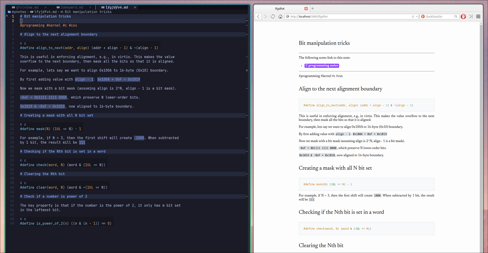

# note-glance



A (mostly AI-written) system to quickly render my notes with custom styling.

Launching the server:

```bash
uv run main.py \
  --notes-dir ~/mynotes \
  --css <path-to-ccs>
```

To customize pandoc generation, uses PANDOC_FLAGS environment variable.
This is an example `.env` file:

```bash
export PANDOC_FLAGS="--defaults /home/khadd/mynotes/support/pandoc.yaml --metadata-file /home/khadd/mynotes/support/metadata.yaml --lua-filter=/home/khadd/mynotes/support/backlinks.lua"
export ZK_NOTEBOOK_DIR="/home/khadd/mynotes"
```

## Neovim

Add this to the Neovim config.

```lua

vim.g["zk_preview_enabled"] = false

local function zk_preview()
  if vim.g["zk_preview_enabled"] then
    local file_path = vim.fn.expand("%:p")
    local home_dir = vim.env.ZK_NOTEBOOK_DIR
    vim.print(file_path)
    if string.find(file_path, "^" .. home_dir) then
      -- Extract the relative path by removing the home_dir prefix
      local relative_path = string.sub(file_path, #home_dir + 2) -- +2 to account for trailing slash
      -- Remove the file extension
      relative_path = string.gsub(relative_path, "%.%w+$", "")
      local url = "http://localhost:5000/" .. relative_path
      -- Choose the appropriate command based on your OS
      -- I uses falkon for quick reload
      vim.fn.jobstart({ "falkon", "-c", url })
    end
  end
end

-- Create an autocmd that triggers when opening markdown files
vim.api.nvim_create_autocmd("BufEnter", {
	pattern = "*.md",
	callback = zk_preview,
})

local function enable_md_preview()
	if vim.g["zk_preview_enabled"] ~= true then
		vim.g["zk_preview_enabled"] = true
		vim.notify("ZK preview enabled", vim.log.levels.INFO)
		zk_preview()
	end
end

local function disable_md_preview()
	if vim.g["zk_preview_enabled"] then
		vim.g["zk_preview_enabled"] = false
		vim.notify("ZK preview disabled", vim.log.levels.INFO)
	end
end

-- Function to toggle the autocmd
local function toggle_md_preview()
	if vim.g["zk_preview_enabled"] then
		disable_md_preview()
	else
		enable_md_preview()
	end
end

vim.api.nvim_create_user_command("ZkPreviewEnable", enable_md_preview, {})
vim.api.nvim_create_user_command("ZkPreviewDisable", disable_md_preview, {})
vim.api.nvim_create_user_command("ZkPreviewToggle", toggle_md_preview, {})
```
